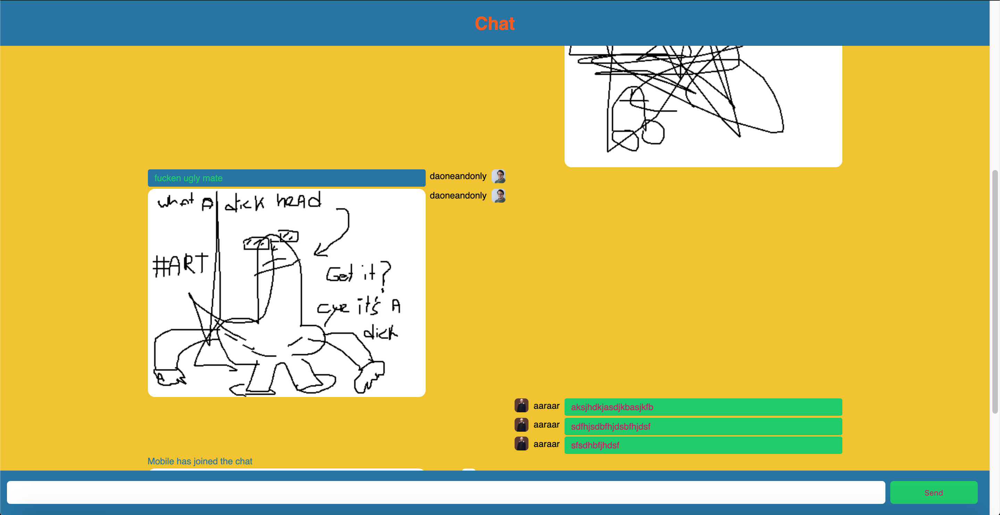

### [Live Demo](https://anon-says-herokuapp.com)
# Draw chat
As an excercise to practice with websockets I created a chat service that let's you choose a username and talk to each other.
All data is send over the wss protocol client-to-server and then server-to-client so it is completely anonymous.
There is an option to start drawing with `/draw` which streams HTML canvas data so all users can see your amazing drawings

## Table of contents
- [To do](#to-do-)
- [Description](#description-)
- [Installing](#installing-)
- [Packages & Services](#packages--services)
- [How it works](#how-it-works-)
- [Technologies Used](#technologies-used-)
    * [Websockets](#websockets)
    * [Express-ws](#express-ws)
- [Goals](#goals)
- [License](#license-)

## To Do 📌
- [x] Connecting to the chat server over websocket
- [X] Keeping track of all sockets and handling the 'close' event
- [x] 'Broadcasting' all messages to all users
- [x] Adding escapes to avoid JS injection
- [x] Automatic avatars from github
- [x] Styling
- [x] `/draw` adds a canvas
- [x] Activati drawing on own canvas
- [x] Sending Canvas data over websockets
- [ ] Adding a game-mode with draw challenges
- [ ] Adding user roles
- [ ] Adding a 'kick user' command

## Description 📝
Simply put, it's a anonymous, websocket based chat client. A perfect example and usecase of websockets.
I implemented a drawing functionality 

## Installing 🔍
To install this application follow these steps:
- `git clone https://github.com/aaraar/real-time-web-1920`
- `cd real-time-web-1920`
- `yarn` / `npm install`
- `yarn start`
    + Run `yarn watch` & `yarn dev` concurrently for development

### Packages & Services
This project makes use of the following tech:

  * [Node](https://nodejs.org/)
  * [Express](https://expressjs.com/)
  * [express-ws](https://github.com/HenningM/express-ws)

## How It Works 🛠️
Core features of this project.

  * Chatting with all connected users
  * Seeing when a user enters or leaves
  * Creating a canvas with `/draw` that only you can draw on and everybody can see
  * Seeing everybody else their drawings
  
## Technologies Used 🖲
### Websockets
- When creating a chat app, websockets is the first thing you should think of.
This technology is perfect for these kind of applications where data should be send and displayed almost instantly to all users.
The websockets in this app makes sure the server has a live connection with all connected users and makes it able for the users to talk to eachother in real-time

### express-ws
- For this project I wanted to make use of websockets without the socket.io package since it does a lot of (great) things in the background,
that I want to learn or do for myself for once. The `express-ws` is still an abstraction layer over the native node `ws` package,
this abstraction however is very small. It handles the link between the websocket and the http server, sends a status code on connection and
implements a router that accepts human-readable strings instead of regular expressions. These are not the functionalities I want to focus on
learning. - `express-ws`

## Goals
- _Websockets in JS without socket.io_
- _Sending and handling abstract data (canvas content)_
- _Deal with real-time complexity_
- _Handle real-time client-server interaction_
- _Handle real-time data management_
- _Handle multi-user support_

## License 🔓
MIT © [Bas de Greeuw](https://github.com/aaraar)

<!-- Add a link to your live demo in Github Pages 🌐-->

<!-- ☝️ replace this description with a description of your own work -->

<!-- replace the code in the /docs folder with your own, so you can showcase your work with GitHub Pages 🌍 -->

<!-- Add a nice image here at the end of the week, showing off your shiny frontend 📸 -->

<!-- Maybe a table of contents here? 📚 -->

<!-- How about a section that describes how to install this project? 🤓 -->

<!-- ...but how does one use this project? What are its features 🤔 -->

<!-- What external data source is featured in your project and what are its properties 🌠 -->

<!-- This would be a good place for your data life cycle ♻️-->

<!-- Maybe a checklist of done stuff and stuff still on your wishlist? ✅ -->

<!-- How about a license here? 📜  -->

[rubric]: https://docs.google.com/spreadsheets/d/e/2PACX-1vSd1I4ma8R5mtVMyrbp6PA2qEInWiOialK9Fr2orD3afUBqOyvTg_JaQZ6-P4YGURI-eA7PoHT8TRge/pubhtml
